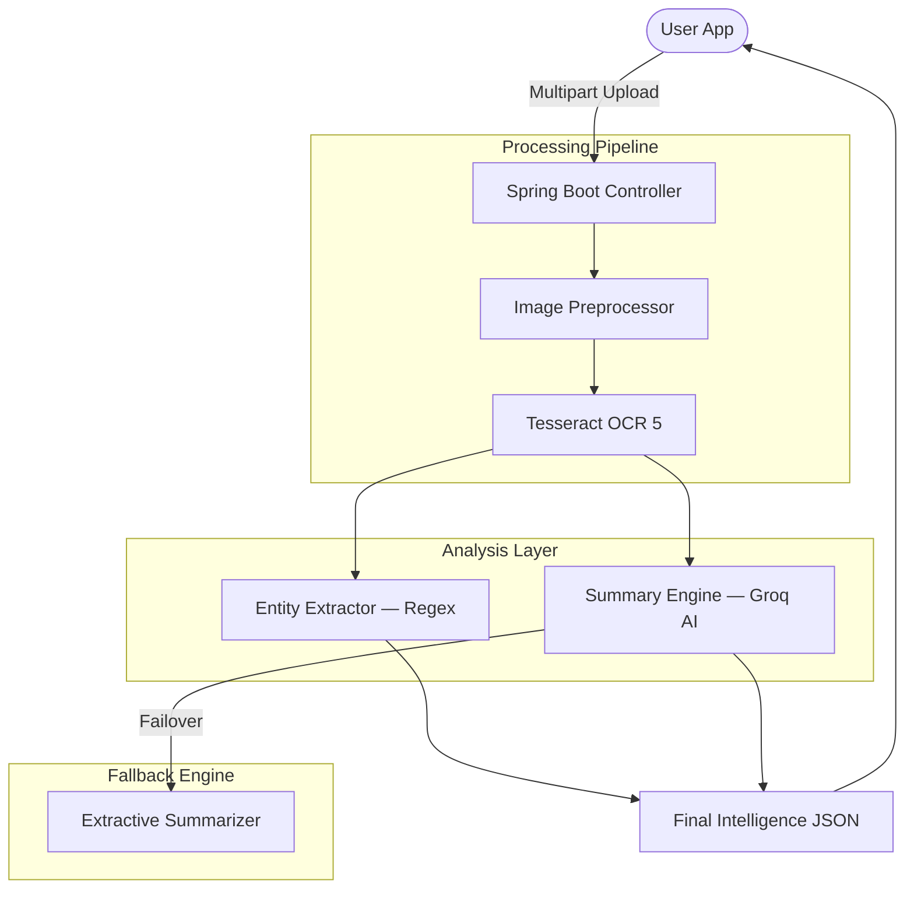
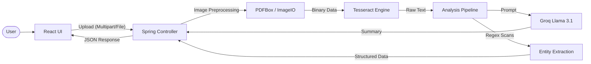

<div align="center">

```
██
```

### **Enterprise Document Intelligence Engine**

_National Hackathon 2026 — Official Submission_

---


---

> **"Transforming mountains of paper into moments of clarity."**
>
> DocuScan bridges the gap between legacy paper workflows and modern AI-driven analysis — serving as a foundation for digital transformation across clinical, legal, and financial sectors.

</div>

---

## 📋 Table of Contents

- [What is DocuScan?](#-what-is-docuscan)
- [Key Features](#-key-features--functional-capabilities)
- [Architecture & Data Flow](#️-detailed-architecture--data-flow)
- [Tech Stack](#️-tech-stack)
- [Getting Started](#-getting-started)
- [Project Structure](#-project-structure)
- [Fallback Mechanisms](#️-fallback-mechanisms)
- [Hackathon Context](#-national-hackathon-2026)

---

## 🔍 What is DocuScan?

DocuScan is a **mission-critical Enterprise Document Intelligence Engine** that transforms unstructured data — scanned physical paper, multi-page PDF contracts, and scattered financial receipts — into a highly structured, searchable, and summarized digital knowledge base.

| Problem                                   | DocuScan Solution                              |
| ----------------------------------------- | ---------------------------------------------- |
| 📄 Thousands of scanned physical papers   | ✅ Intelligent OCR with preprocessing pipeline |
| 🔎 Hours spent reading contracts manually | ✅ Sub-second AI summarization via Groq LPUs   |
| 🗂️ Unstructured financial data            | ✅ Automated entity & amount extraction        |
| ❌ No way to verify OCR accuracy          | ✅ Side-by-side human verification HUD         |

---

## 🌟 Key Features & Functional Capabilities

### 1. 🧠 Intelligent OCR (Optical Character Recognition)

Powered by **Tesseract 5.0** — the gold standard in open-source OCR — with a full preprocessing pipeline that runs _before_ text extraction to maximize accuracy on low-quality scans.

```
Raw Scan ──► Grayscale ──► Contrast Enhancement ──► Deskew & Denoise ──► Tesseract 5.0 ──► Raw Text
```

| Preprocessing Step       | Purpose                                                 |
| ------------------------ | ------------------------------------------------------- |
| **Grayscale Conversion** | Reduces colour noise, focuses on structural contrast    |
| **Contrast Enhancement** | Distinguishes text pixels from background shadows       |
| **Deskewing**            | Corrects page tilt from imperfect scanner alignment     |
| **Denoising**            | Smooths pixel-level artifacts from low-quality hardware |

- **Multimodal Support** — Seamlessly processes both raster images (JPG, PNG) and vector-to-raster converted PDFs.

---

### 2. ⚡ Cognitive Summarization (LLM Interface)

Integrated with **Groq's Llama 3.1 8B Instant** model running on Language Processing Units (LPUs) for near-instant inference.

> Unlike traditional GPU-based LLM APIs, Groq's hardware delivers document summaries in **milliseconds, not seconds.**

The LLM doesn't merely extract text — it _understands_ document intent:

- Identifies document type automatically _(e.g., "This is a Rental Agreement")_
- Focuses summarization on obligations, deadlines, and key terms
- Gracefully degrades to a local extractive fallback if the API is unavailable

---

### 3. 🔎 Automated Entity Extraction (Regex-Driven)

A sophisticated pattern-matching engine purpose-built for enterprise documents — not a generic scanner.

| Entity Type          | Detection Method                         | Examples                                 |
| -------------------- | ---------------------------------------- | ---------------------------------------- |
| 💰 **Financials**    | Multi-currency regex + keyword proximity | `$1,500.00`, `€200`, `₹50,000`           |
| 📅 **Dates**         | 15+ format variations                    | `MM/DD/YYYY`, `DD-MM`, ISO 8601, Textual |
| 🔢 **Business IDs**  | Invoice/Bill/Receipt patterns            | `INV-2024-00421`, `REF#8821`             |
| 📧 **Contact Nodes** | Validated email & phone patterns         | `user@corp.com`, `+91-99XX-XXXXX`        |
| ✍️ **Signatories**   | Label-proximity detection                | `Authorized by: John Doe`                |

---

### 4. 🖥️ Enterprise UI/UX

Built for efficiency, not just aesthetics.

- **Dual-Phase Progress Bar** — Real-time feedback during both _Upload_ (network) and _Analysis_ (compute) phases — users always know what's happening.
- **Side-by-Side HUD** — A high-efficiency "Heads Up Display" showing the original scanned image next to the extracted OCR text for instant human verification.
- **System Health Monitoring** — Proactive backend status tracking informs users when the analysis engine is ready before they attempt an upload.
- **Drag-and-Drop Ingestion** — Secure upload zone with client-side file header validation before any data leaves the browser.

---

## 🏗️ Detailed Architecture & Data Flow

DocuScan operates on a **decentralised, layered processing model** with four distinct stages:

### The Four Layers

```
┌─────────────────────────────────────────────────────────┐
│  LAYER 1: INGESTION                                     │
│  React Upload Gateway → validates headers → Spring Boot │
└───────────────────────────┬─────────────────────────────┘
                            │ MultipartFile
┌───────────────────────────▼─────────────────────────────┐
│  LAYER 2: TRANSFORMATION                                │
│  PDFBox 3.0 (PDF→Image) → Java AWT ImagePreprocessor   │
└───────────────────────────┬─────────────────────────────┘
                            │ Preprocessed Binary
┌───────────────────────────▼─────────────────────────────┐
│  LAYER 3: SYNTHESIS                          [PARALLEL] │
│  Tesseract OCR ──┬──► EntityExtractionService (local)  │
│                  └──► SummaryService (Groq Cloud AI)    │
└───────────────────────────┬─────────────────────────────┘
                            │ Structured JSON
┌───────────────────────────▼─────────────────────────────┐
│  LAYER 4: PRESENTATION                                  │
│  React State Machine: PROCESSING ──► DONE              │
└─────────────────────────────────────────────────────────┘
```

### Pipeline Flow Diagram



---

## 🛠️ Tech Stack

### Backend — Java / Spring Boot

| Component          | Technology                    | Version |
| ------------------ | ----------------------------- | ------- |
| **Framework**      | Spring Boot                   | `3.4.0` |
| **Runtime**        | Java (JDK)                    | `21`    |
| **OCR Engine**     | Tess4J _(Tesseract wrapper)_  | `5.x`   |
| **PDF Handler**    | Apache PDFBox                 | `3.0.3` |
| **AI Integration** | Groq Cloud API — Llama 3.1 8B | Latest  |
| **JSON Handling**  | Jackson Databind              | Bundled |

### Frontend — React / Vite

| Component         | Technology                           | Version |
| ----------------- | ------------------------------------ | ------- |
| **Framework**     | React                                | `19`    |
| **Build Tool**    | Vite                                 | `8`     |
| **Styling**       | Tailwind CSS                         | `4.0`   |
| **Icons**         | React Icons _(Hi primitives)_        | Latest  |
| **File Handling** | React Dropzone                       | Latest  |
| **Networking**    | Axios _(with progress interceptors)_ | Latest  |

---

## 🚀 Getting Started

### Prerequisites

Before you begin, ensure you have the following installed:

- ☑️ **Java Development Kit (JDK 21)**
- ☑️ **Node.js (LTS)** & npm
- ☑️ **Maven** (`mvn` on PATH)
- ☑️ **Tesseract OCR Engine**

**Installing Tesseract:**

```bash
# Linux (Debian/Ubuntu)
sudo apt install tesseract-ocr

# macOS (Homebrew)
brew install tesseract

# Windows
# Download installer from: https://github.com/UB-Mannheim/tesseract/wiki
```

---

### Step 1: Clone the Repository

```bash
git clone https://github.com/your-team/docuscan.git
cd docuscan
```

---

### Step 2: Backend Setup

```bash
# Navigate to backend directory
cd backend

# Create application properties
cp src/main/resources/application.properties.example \
   src/main/resources/application.properties
```

Open `src/main/resources/application.properties` and configure your Groq API key:

```properties
# ─── Groq AI Configuration ───────────────────────────────
groq.api.key=YOUR_GROQ_API_KEY_HERE

# ─── Tesseract Path (Windows only — remove on Linux/macOS) ──
# tesseract.path=C:\\Program Files\\Tesseract-OCR\\tesseract.exe

# ─── Server Config ───────────────────────────────────────
server.port=8080
```

> 💡 **Get a free Groq API key at [console.groq.com](https://console.groq.com)**. The system works without it via the extractive fallback.

Start the backend:

```bash
mvn spring-boot:run
```

✅ Server running at: `http://localhost:8080`

---

### Step 3: Frontend Setup

```bash
# Open a new terminal and navigate to frontend
cd frontend

# Install dependencies
npm install

# Start the development server
npm run dev
```

✅ App available at: `http://localhost:5173`

---

### Quick Start (Both servers, one command)

If you have `make` installed:

```bash
# From the project root
make dev
```

---

## 📂 Project Structure

```
docuscan/
│
├── backend/                          # Spring Boot application
│   ├── src/main/java/com/docuscan/
│   │   ├── controller/
│   │   │   └── DocumentController.java     # REST API endpoints
│   │   ├── service/
│   │   │   ├── PdfService.java             # PDFBox PDF→Image conversion
│   │   │   ├── ImagePreprocessor.java      # AWT preprocessing pipeline
│   │   │   ├── OcrService.java             # Tess4J OCR wrapper
│   │   │   ├── EntityExtractionService.java # Regex entity extraction
│   │   │   └── SummaryService.java         # Groq AI + fallback summarizer
│   │   └── model/
│   │       └── DocumentResult.java         # Response payload model
│   ├── src/main/resources/
│   │   └── application.properties          # Config (API keys, ports)
│   └── pom.xml                             # Maven dependencies
│
├── frontend/                         # React + Vite application
│   ├── src/
│   │   ├── components/
│   │   │   ├── UploadZone.jsx              # Drag-and-drop ingestion
│   │   │   ├── ProgressTracker.jsx         # Dual-phase progress bar
│   │   │   ├── SplitViewHUD.jsx            # Side-by-side verification
│   │   │   ├── EntityPanel.jsx             # Extracted entities display
│   │   │   └── SummaryCard.jsx             # Executive summary output
│   │   ├── hooks/
│   │   │   └── useDocumentProcessor.js     # Upload + polling logic
│   │   ├── App.jsx
│   │   └── main.jsx
│   ├── package.json
│   └── vite.config.js
│
└── README.md
```

### Full Pipeline (Reference Diagram)



---

## 🛡️ Fallback Mechanisms

DocuScan is engineered for **production resilience**, not just happy-path demos.

| Failure Scenario                 | Fallback Behaviour                                    |
| -------------------------------- | ----------------------------------------------------- |
| **Groq API key missing**         | Auto-activates local extractive summarizer            |
| **Groq API rate-limited / down** | Seamless failover — user sees no error                |
| **Low-quality scan**             | Preprocessing pipeline compensates for deskew & noise |
| **Corrupted PDF page**           | Page is skipped; remaining pages are processed        |

The **extractive summarizer** uses a local sentence-scoring algorithm to identify the most information-dense sentences in the document — no API calls, no latency, no cost.

---

## 🏆 National Hackathon 2026

<div align="center">

This project was built end-to-end for the **National Hackathon 2026** as a production-grade solution for enterprise document automation and digital transformation.

---

\*Developed with ❤️ by the **DocuScan Team\***

_© 2026 DocuScan — National Hackathon Submission_

</div>
